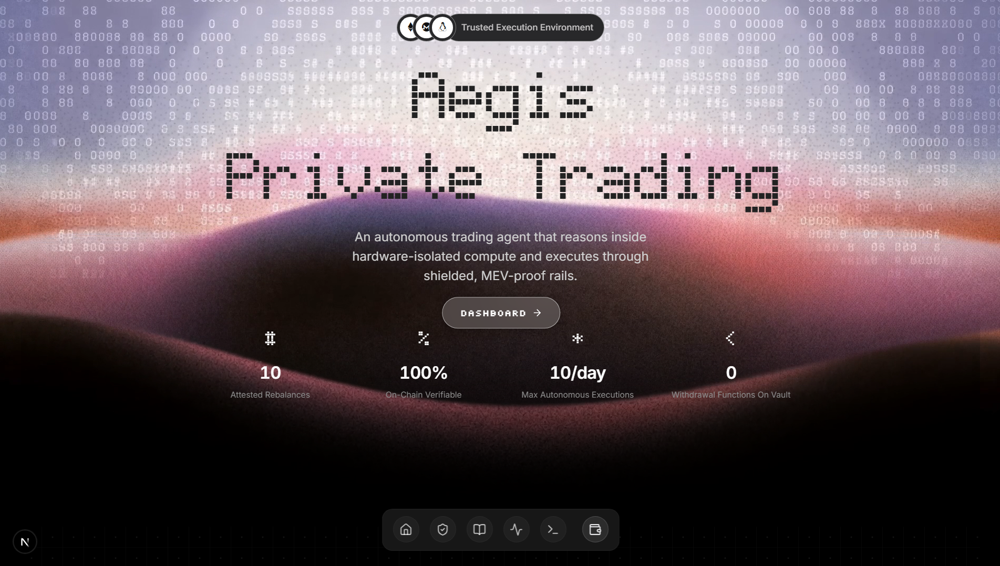
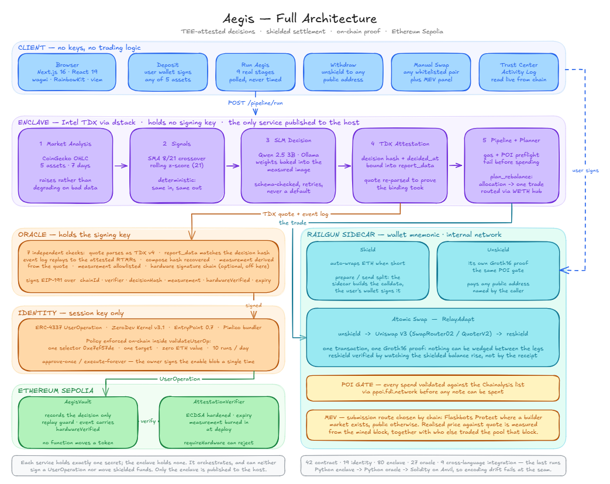

# Aegis

**An autonomous trading agent that can prove what it decided, without showing you the money.**

Aegis runs a portfolio strategy inside a hardware-isolated enclave, records every decision
on-chain as a signed attestation *before any funds move*, and settles the resulting trade
inside Railgun's shielded pool. You can verify the agent did what it said. You cannot see
what it holds.

Built for **Road to Devcon — NITK Surathkal**, on the theme *Make Private Apps using Ethereum*.



---

## The problem

Two things you want from an automated trading agent pull against each other.

You want to **verify it actually did what it claimed** — most trading bots are a black box
with a Twitter account. Nothing stops the operator swapping the model out, trading against
their own users, or rewriting the story after a bad week.

You also want your **positions not readable by everyone**. Putting the bot on-chain fixes
the first problem and makes the second one far worse: your entries, your sizing, and
eventually your whole strategy become a public document that anyone can trade against.

So you pick one: *trustworthy but exposed*, or *private but unverifiable*. Aegis is an
attempt to refuse that trade.

---

## How it works

A single run moves through nine stages. Each advances only when the underlying call returns
a real result — there are no timers, and a failure stops the run and names the stage rather
than skipping ahead.

| # | Stage | What actually happens |
|---|---|---|
| 1 | Market analysis | CoinGecko OHLC → SMA crossovers and rolling z-scores. Deterministic; raises rather than degrading on missing data. |
| 2 | AI decision | A local SLM turns those signals into an allocation. Schema-validated; no default is ever substituted. |
| 3 | TDX attestation | The decision hash is bound into a hardware quote as `report_data`, then re-parsed to confirm the binding took. |
| 4 | Oracle verification | An independent service replays the event log against the attested registers, derives the measurement, and signs. |
| 5 | On-chain execution | An ERC-4337 UserOperation records the attested decision. Signature, measurement and expiry all checked on-chain. |
| 6 | Proof of Innocence | A real gate: funds must be validated against the required sanctions list before they can be spent. |
| 7 | Private swap | The trade the allocation implies — one atomic transaction unshields, swaps, and reshields. |
| 8 | Reshield | Verified by watching the shielded balance actually increase, not inferred from the transaction succeeding. |
| 9 | Confirmed | Vault log entry and settlement transaction cross-checked against each other. |

<!-- TODO: screenshot of the nine stages completing -->
<!--  -->

### The decision drives the trade

The allocation isn't decorative. `plan_rebalance` values each shielded holding using the
same prices the model was shown, compares them against the attested target, and executes
the single trade that closes the largest gap. A caller may cap the trade size; it cannot
choose the direction, because direction belongs to the decision that was signed.

Trades route through WETH, because the swap recipe is single-hop and WETH is the only asset
on Sepolia with a pool against all four others.

---

## Architecture



Every service holds exactly one secret and refuses to do anything outside its remit:

| Service | Holds | Cannot |
|---|---|---|
| `enclave` | **nothing** | sign a UserOperation, or move shielded funds |
| `identity` | session key | spend outside one selector on one contract |
| `oracle` | attestation signing key | produce a quote, or move funds |
| `railgun-sidecar` | wallet mnemonic | be reached from the host or the internet |

Only the enclave is published to the host. The other three sit on an `internal: true`
Docker network with no port mapping, which `scripts/verify_deployment.sh` asserts from
outside.

---

## The trust model

The distinction between *proven* and *disclosed* matters more than any individual feature.

| Claim | Status | What backs it |
|---|---|---|
| The decision came from this exact code | **Proven** | Measurement derived from the quote, checked on-chain against a value burned in at deploy. |
| The agent cannot steal the funds | **Proven** | The session key calls one function, on one contract, with zero value — and that contract has no function that moves a token. |
| Positions are private | **Proven** | Balances are commitments in Railgun's pool, spent by zero-knowledge proof. |
| The trade follows the attested decision | **Proven** | Pair and size derived from the allocation and current holdings. |
| Nothing was extracted by a searcher | **Measured** | Reported per swap from the mined block — realised price against quote, and whether anyone traded both sides. |
| The code ran on real secure hardware | **Disclosed** | This deployment runs a TDX simulator. That fact is signed into the attestation and emitted on-chain with every decision. |

`AttestationVerifier.requireHardware` will reject simulator-backed decisions outright. It is
off here because this deployment honestly is a simulator — the flag works, and we tested
that it reverts with `HardwareAttestationRequired()`.

---

## Deployment — Ethereum Sepolia

| | |
|---|---|
| `AegisVault` | [`0x518D2de68f1088a04a1F3a5Ea6360f357f80878d`](https://sepolia.etherscan.io/address/0x518D2de68f1088a04a1F3a5Ea6360f357f80878d) |
| `AttestationVerifier` | [`0xCEe775680Ca45192F00181643DAba9A18150059B`](https://sepolia.etherscan.io/address/0xCEe775680Ca45192F00181643DAba9A18150059B) |
| Smart account | `0x61e7eDBD1C14C7F0B14513958e94d9f58770E662` |
| Oracle signer | `0x0212AdAc560383416B4973Ded96c35Dcb912531A` |
| Enclave measurement | `0x94261f530c8d08cdda5620deecce45120d745a871c9ed96f08ab428de17a1af4` |
| Whitelisted assets | WETH, USDC, DAI, LINK, UNI |
| Session key policy | 10 runs/day · one selector `0xe7ef57de` · zero value |

---

## Running it

**Prerequisites:** Docker, Node 20+, Python 3.11+, [Foundry](https://getfoundry.sh).

```bash
cp .env.example .env      # fill in RPC, bundler and wallet keys
docker compose up -d      # enclave, oracle, identity, railgun-sidecar, simulator
```

The enclave image bakes in the model weights, so the first build pulls several GB and takes
a while. Once the stack is healthy:

```bash
scripts/deploy_sepolia.sh   # deploys both contracts against the running enclave's measurement
scripts/bootstrap.sh        # creates and binds the session key
cd frontend && npm run dev  # http://localhost:3000
```

`scripts/verify_deployment.sh` checks the live configuration matches what is committed, and
`scripts/run_full_pipeline.sh` runs the same nine stages from the CLI.

### Tests

```bash
cd contracts && forge test              # 42 — contracts
cd identity   && npm test               # 19 — session-key policy
docker compose exec enclave python -m pytest   # 80 — attestation, signals, planner
docker compose exec oracle  python -m pytest   # 27 — quote parsing, signing
```

---

## Stack

Here is how each piece of the stack earns its place:

**Trusted compute** — the decision has to be provable, so it runs in a measured enclave
with the model weights inside the measurement.

[](https://github.com/Dstack-TEE/dstack)
[](https://ollama.com)
[](https://fastapi.tiangolo.com)
[](https://python.org)

**Chain** — the attestation is checked on-chain, and the agent's authority is a session
key the contract itself constrains.

[](https://soliditylang.org)
[](https://getfoundry.sh)
[](https://eips.ethereum.org/EIPS/eip-4337)
[](https://sepolia.etherscan.io)

**Privacy** — balances are commitments, spends are proofs, and every spend passes a
sanctions gate before it is allowed.

[](https://railgun.org)
[](https://github.com/iden3/snarkjs)
[](https://docs.railgun.org/wiki/assurance/proof-of-innocence)
[](https://docs.uniswap.org)

**Frontend and infra** — holds no keys and no trading logic; it starts jobs and reads state.

[](https://nextjs.org)
[](https://react.dev)
[](https://typescriptlang.org)
[](https://wagmi.sh)
[](https://docker.com)

---

## Repository

```
contracts/         AegisVault + AttestationVerifier, Foundry tests
enclave/           signals, SLM, TDX attestation, pipeline orchestration
oracle/            off-chain quote verification and attestation signing
identity/          ERC-4337 smart account and session-key management
railgun-sidecar/   shielded pool: shield, unshield, atomic swap, POI
frontend/          Next.js dashboard
shared/            config and ABIs — the single source of truth
scripts/           deploy, bootstrap, verify, full-pipeline
```

Each directory has its own README explaining what it does and why it is shaped that way.
`shared/config` is generated into the frontend by `scripts/sync_frontend_config.py`, so the
UI can never drift from what is deployed.

---

## Known limitations

Listed because a demo that hides them is a demo that gets found out.

- **The enclave is simulated.** Every verification path runs; none of it proves silicon.
- **Settlement is submitted from a public address.** Amounts stay hidden, but one address
  broadcasts every settlement, which links them to each other. Railgun's broadcaster network
  is the designed fix and is not yet wired in.
- **The enclave API is unauthenticated.** Fine bound to localhost for a demo; it must not be
  exposed on a shared network.
- **One corrective trade per run.** A badly drifted portfolio converges over several runs.
- **The model is small.** Qwen 2.5 3B responds to its signals but is not a serious
  quantitative strategy. The contribution is the pipeline around it.
